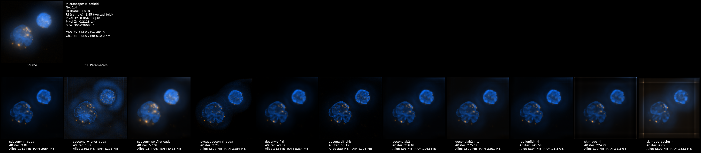
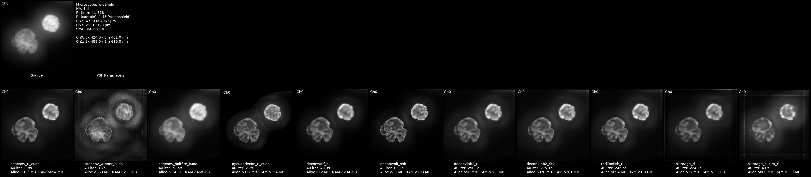
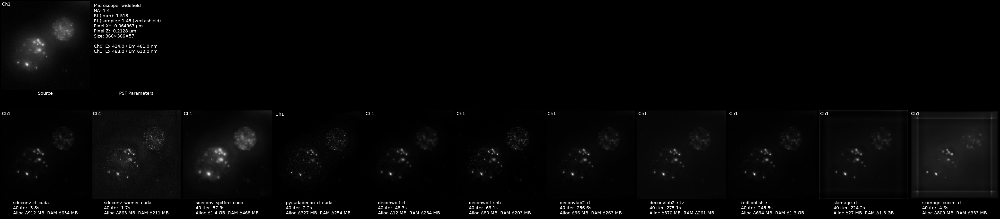

# CIDeconvolve — Benchmark Results

The built-in benchmark mode runs every available deconvolution method on the
same input image and records timing and resource-usage metrics.  Enable it
with `--benchmark True` (or tick the checkbox in the launcher).

The results below were generated on a system with:

- **CPU:** multi-core (see `cpu_percent_peak` for utilisation)
- **RAM:** 64 GB
- **GPU:** NVIDIA GPU with ~24 GB VRAM

Input: **DNAcrop** — a centre-cropped two-channel OME-TIFF, 40 iterations.

---

## Visual comparison

### Both channels — composite montage



### Channel 0



### Channel 1



Each panel is annotated with method name, PSF parameters (NA, refractive
indices, microscope type, wavelengths), compute device, and key performance
metrics.

---

## Metrics table

| Method | Device | Time (s) | CPU % avg | CPU % peak | RAM peak (MB) | RAM Δ peak (MB) | GPU util avg (%) | GPU mem peak (MB) | GPU mem Δ peak (MB) | Torch GPU peak (MB) | Torch Δ (MB) |
|--------|--------|----------|-----------|------------|---------------|-----------------|-------------------|-------------------|---------------------|---------------------|--------------|
| sdeconv_wiener | CUDA | **1.69** | 189.0 | 917.7 | 1 311 | 211 | 4.9 | 4 515 | 946 | 863 | 863 |
| pycudadecon_rl_cuda | CUDA | **2.16** | 160.1 | 974.6 | 1 545 | 254 | 19.6 | 3 923 | 327 | 0 | 0 |
| sdeconv_rl | CUDA | 3.77 | 144.2 | 981.2 | 1 274 | 654 | 21.1 | 4 566 | 1 257 | 912 | 912 |
| skimage_cucim_rl | CUDA | 4.56 | 125.2 | 770.3 | 1 894 | 333 | 31.8 | 4 179 | 809 | 0 | 0 |
| deconwolf_rl | CPU | 48.32 | 6.1 | 729.9 | 1 580 | 234 | 5.9 | 3 622 | 12 | 0 | 0 |
| sdeconv_spitfire | CUDA | 57.93 | 103.0 | 1 025.9 | 1 546 | 468 | 95.3 | 5 550 | 1 981 | 1 448 | 1 448 |
| deconwolf_shb | CPU | 63.06 | 5.2 | 651.8 | 1 609 | 203 | 4.7 | 3 651 | 80 | 0 | 0 |
| skimage_rl | CPU | 224.18 | 101.0 | 669.9 | 2 856 | 1 316 | 5.8 | 3 500 | 27 | 0 | 0 |
| redlionfish_rl | CL/CPU | 245.50 | 2 908.5 | 3 570.6 | 2 683 | 1 366 | 6.4 | 4 415 | 694 | 0 | 0 |
| deconvlab2_rl | CPU | 256.61 | 1.6 | 642.8 | 1 581 | 263 | 6.0 | 3 680 | 96 | 0 | 0 |
| deconvlab2_rltv | CPU | 275.05 | 1.6 | 917.0 | 1 579 | 261 | 6.2 | 3 964 | 370 | 0 | 0 |

Table is sorted by execution time (fastest first).

---

## Metric descriptions

| Column | Meaning |
|--------|---------|
| **Device** | Compute backend used: `CUDA` (NVIDIA GPU), `CPU`, or `CL/CPU` (OpenCL GPU with CPU fallback). |
| **Time (s)** | Wall-clock time for the deconvolution step (excluding PSF generation and I/O). |
| **CPU % avg / peak** | Average and peak CPU utilisation across all cores (100 % = one full core). Values above 100 % indicate multi-threaded execution. |
| **RAM peak (MB)** | Peak resident set size of the Python process during the run. |
| **RAM Δ peak (MB)** | Increase in RAM from baseline to peak — the net memory allocated by the method. |
| **GPU util avg (%)** | Average GPU compute utilisation as reported by `nvidia-smi` polling. |
| **GPU mem peak (MB)** | Peak GPU memory allocated (driver-level, includes framework overhead). |
| **GPU mem Δ peak (MB)** | Net GPU memory increase during the method run. |
| **Torch GPU peak (MB)** | Peak GPU memory tracked by PyTorch's CUDA memory allocator (only nonzero for PyTorch-based sdeconv methods). |
| **Torch Δ (MB)** | Net PyTorch-allocated GPU memory increase. |
| **GPU spill (MB)** | GPU memory that spilled to system RAM (not shown above — was 0 for all methods in this run). |

---

## Key observations

1. **Fastest methods:** `sdeconv_wiener` (1.7 s) is a single-pass
   frequency-domain filter — the fastest overall.  Among iterative RL
   methods, `pycudadecon_rl_cuda` (2.2 s) and `sdeconv_rl` (3.8 s) lead
   by a wide margin thanks to CUDA GPU acceleration.

2. **GPU memory:** `sdeconv_spitfire` requires the most GPU VRAM
   (~5.5 GB peak) due to its optimisation-based sparse + TV solver.
   Methods that do not use PyTorch (pycudadecon, cuCIM, deconwolf,
   redlionfish) show zero in the Torch columns.

3. **CPU-only methods:** `skimage_rl`, `deconvlab2_rl`, and
   `deconvlab2_rltv` are 100–150× slower than the GPU-accelerated
   alternatives.  They remain useful for systems without a compatible GPU.

4. **RedLionfish anomaly:** Despite being OpenCL-capable, redlionfish
   shows very low GPU utilisation (6.4 %) and high CPU load (~2 900 %).
   This suggests it fell back to CPU multi-threading on this system,
   possibly due to OpenCL device selection or data-size limits.

5. **Memory efficiency:** `pycudadecon_rl_cuda` is notably memory-efficient
   on the GPU side (327 MB Δ) while also being extremely fast,
   reflecting its optimised CUDA kernel implementation.

---

## Running your own benchmark

```bash
# Via Docker
docker run --rm --gpus all \
    -v /path/to/images:/data/in \
    -v /path/to/output:/data/out \
    -v /tmp/gt:/data/gt \
    cellularimagingcf/w_cideconvolve \
    --infolder /data/in --outfolder /data/out --gtfolder /data/gt \
    --benchmark True --bench_methods all --bench_iterations "20, 40, 60"

# Via the launcher
python launcher.py
# → tick "Perform Benchmark", choose methods & iterations, click Run
```

Results are written to `--outfolder`:
- `benchmark_metrics_<name>.csv` — the full metrics table
- `decon_benchmark_<name>.png` — composite montage
- `decon_benchmark_<name>_ch<N>.png` — per-channel montages

---

*See also:* [README.md](README.md) · [METHODS.md](METHODS.md)
